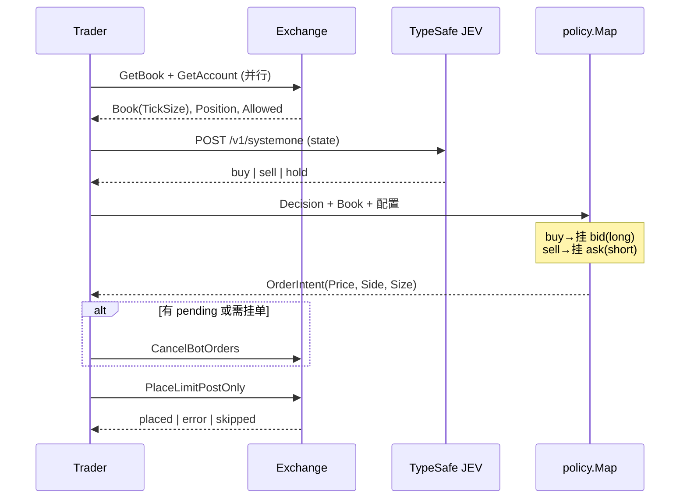

# JEV 做市 Bot：系统流程与交易所 API

本文描述 **Style A**（每 tick 撤旧 + 1 张 post-only）从启动到下单的完整链路，并对照 **Lighter (RB)** 与 **Vanta (Orderly)** 的 REST 用法。官方参考：

- Vanta 概念与入口：[Vanta GitBook — API](https://vanta-6.gitbook.io/vanta-gitbook/core-concepts/api)
- Orderly REST 基址：`https://api.orderly.org`
- Orderly 认证：[API Authentication](https://orderly.network/docs/build-on-omnichain/api-authentication)
- Lighter RB：`https://api.rh.lighter.xyz`（链 ID 466324）

---

## 1. 端到端流程（每个 TICK_INTERVAL）

| 步骤 | 代码 | 说明 |
|------|------|------|
| 定时 | `internal/trader/trader.go` `Run` | `TICK_INTERVAL`，默认 2s；`TryLock` 防重入 |
| 盘口/账户 | `GetBook` / `GetAccount` | `errgroup` 并行 |
| 决策 | `internal/model` | `TYPESAFE_BASE_URL` + Key 池；402/429 轮换 key |
| 映射 | `internal/policy/policy.go` | **同向**：JEV `buy`→做多侧 bid，`sell`→做空侧 ask；持反向仓时 `reduce_only` |
| 报价 | `internal/book/quote.go` | `BestBid/Ask ± insideTicks×TickSize`，不穿越对手价 |
| 执行 | `CancelBotOrders` → `PlaceLimitPostOnly` | Style A：最多 1 张 bot 单 |

环境：`EXCHANGE=mock|lighter|vanta`，`DRY_RUN=true` 时不签名、不下真实单。

---

## 2. JEV（TypeSafe）

| 项 | 值 |
|----|-----|
| 方法 | `POST {TYPESAFE_BASE_URL}/v1/systemone` |
| 认证 | `Authorization: Bearer {TYPESAFE_API_KEY}`（或 `TYPESAFE_API_KEYS` 池） |
| 输入 | 由 `trader.buildState` 组装的 market + position + 近期 mid 等 |
| 输出 | `action`（buy/sell/hold）、`confidence` 等 |

配置：`JEV_TIMEOUT`、`JEV_MIN_CONFIDENCE`、`TYPESAFE_KEY_INDEX`（按交易所默认槽位）。

---

## 3. Vanta / Orderly

### 3.1 启动

1. `GET v1/public/info/{symbol}` → `quote_tick`（如 **0.1**）、`base_tick`（如 **0.00001**）。
2. Live：`VANTA_ORDERLY_ACCOUNT_ID`、`VANTA_ORDERLY_SECRET`（ed25519 seed/base58）→ 签名头。

符号默认：`PERP_{SYMBOL}_USDC`（如 `PERP_BTC_USDC`）。

### 3.2 公开接口

| 用途 | 方法 | 路径 / Body |
|------|------|----------------|
| 盘口 | `POST` | `v1/public/query`，`{"type":"orderbook","symbol":"PERP_BTC_USDC"}` |
| 合约信息 | `GET` | `v1/public/info/PERP_BTC_USDC` |

盘口解析后：`BestBid`/`BestAsk`/`Mid` 按 `quote_tick` **SnapToTick**（`internal/book/tick.go`）。

### 3.3 私有接口

| 用途 | 方法 | 路径 / Body | Content-Type |
|------|------|-------------|--------------|
| 仓位 | `GET` | `/v1/position/{symbol}` | `application/x-www-form-urlencoded` |
| 下单 | `POST` | `/v1/order` JSON：`order_type=POST_ONLY`, `side`, `order_price`, `order_quantity`, `client_order_id`, `reduce_only` | `application/json` |
| 撤单 | `DELETE` | `/v1/order?order_id=&symbol=` | `application/x-www-form-urlencoded` |

签名头：`orderly-account-id`、`orderly-key`、`orderly-timestamp`、`orderly-signature`（见 Orderly 文档）。

### 3.4 价格与 -1103

Orderly 错误 **-1103**：`Order price does not match the tick size.`

原因常见两类：

1. **报价算法**：`bid±tick` 在 float64 下产生 `85391.099999…`，旧逻辑用向下取整会得到错误 tick 倍数。
2. **JSON 序列化**：`order_price` 以 float 写出 `85391.20000000001`。

当前实现：

- 全链路使用 `book.SnapToTick` / `book.FormatOrderlyPrice`（整数 tick 计数 + 固定小数位字符串）。
- 下单 body 中 `order_price`、`order_quantity` 使用 **`json.Number(字符串)`**，避免浮点噪声。

### 3.5 撤单与状态

- 本地只跟踪 **一张** `pendingOrder`（Style A）。
- 撤单若返回 **order is completed**（如 code **-1006**）→ 视为已成交/已结束，清空 pending，不整 tick 失败。

---

## 4. Lighter (RB)

### 4.1 双账户 `LIGHTER_DUAL`

| JEV | 执行账户 | 挂单 |
|-----|----------|------|
| buy | A（`LIGHTER_ACCOUNT_A_INDEX`） | long / bid |
| sell | B（`LIGHTER_ACCOUNT_B_INDEX`） | short / ask |
| hold | — | 撤 A+B，不挂新单 |

订单簿仍用公开 API（与账户无关）。`policy.Map` 的仓位/allowed 按 **活跃腿** 取值（buy→A，sell→B）。

## 4.2 Lighter API（单账户）

| 用途 | 方法 | 路径 |
|------|------|------|
| 盘口 | `GET` | `/api/v1/orderBookOrders?market=...` |
| 账户 | `GET` | `/api/v1/account?by=index&value=` |
| 下单/撤单 | Live | `lighter-go` + `sendTx`（非本文件详述） |

注意：`min_base_amount` 等为 **字符串**，解析用 `flexFloat`；尾仓小于最小量会 `size below min_base`。

---

## 5. 配置速查

见 `configs/example.env`：`EXCHANGE`、`DRY_RUN`、`ORDER_SIZE_BTC`、`MAX_POSITION_BTC`、`QUOTE_INSIDE_TICKS`、`MIN_SPREAD_BPS` 等。

Vanta 专用：`VANTA_BASE_URL`、`VANTA_SYMBOL`、`VANTA_ORDERLY_*`。

---

## 6. 日志字段

每条 tick JSONL：

- `ms` / `ms_book` / `ms_jev` / `ms_exec`：阶段耗时
- `order`：`placed` | `error` | `skipped` | `sim`
- `order_err`：交易所原始错误（如 `-1103`）

若仍见 -1103，请确认已 **重新编译** 且 `GetBook` 的 `TickSize` 来自 `quote_tick`（非默认 0.5）。
